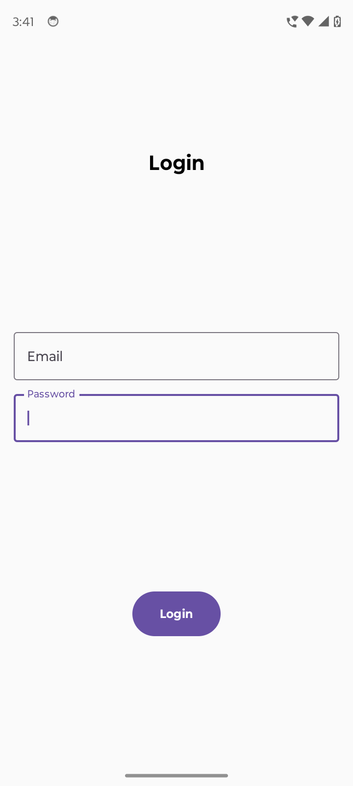
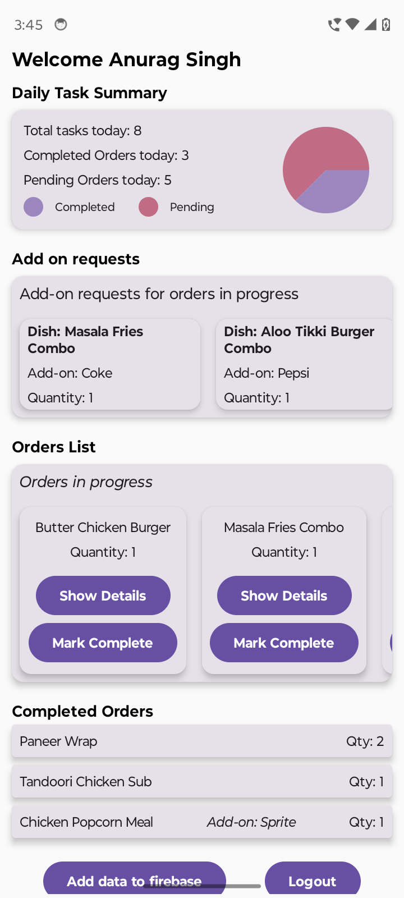
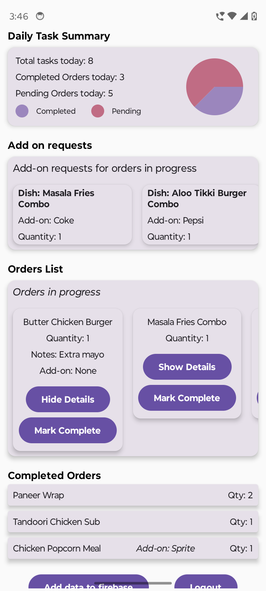

# Food Management System - Cook Application

## Overview
The Food Management System Cook Application streamlines the workflow for cooks by providing an efficient way to manage meal preparations, add-on requests, and subscriber notes. The app uses Firebase for authentication and database storage, ensuring a reliable and scalable backend.

---

## Features

- **Dashboard**: Displays the cook's daily task summary, including regular meals and add-ons.
- **Food Orders List**: Lists dishes with quantities, distinguishing between regular meals and add-ons.
- **Meal Details**: Shows detailed information about each dish, including subscriber notes.
- **Task Management**: Allows marking tasks as completed.
- **Login System**: Secure login with Firebase email/password authentication.

---

## Tech Stack

### Frontend:
- **Kotlin**: Programming language for Android development.
- **Jetpack Compose**: Modern toolkit for building native Android UI.

### Backend:
- **Firebase Authentication**: Secure login with email and password.
- **Firebase Realtime Database**: Stores and retrieves task data efficiently.

---

## Screenshots


### Screenshots

<p align="center">
  
  
  
</p>

---

## Run Instructions

### Prerequisites
1. Install **Android Studio** (latest version recommended).
2. Set up an Android device or emulator (API level 24 or higher).
3. Clone this repository:
   ```bash
   git clone <https://github.com/and-anurag/Cook_Application_Order_Management>
   ```

### Steps to Run
1. Open the project in Android Studio.
2. Sync the Gradle files by clicking **"Sync Project with Gradle Files"**.
3. Add your Firebase configuration:
   - Go to the Firebase Console and download the `google-services.json` file.
   - Place it in the `app/` directory of your project.
4. Build the project by clicking **"Build > Make Project"**.
5. Run the application on an emulator or physical device by clicking **"Run > Run 'app'"**.

---

## Notes

- **Firebase Configuration**: Make sure your Firebase project is set up correctly with Realtime Database and Authentication enabled.

